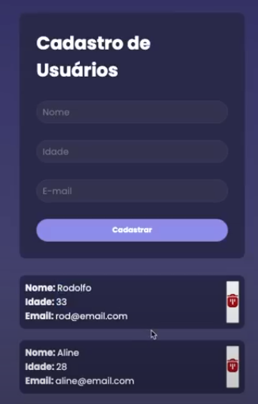
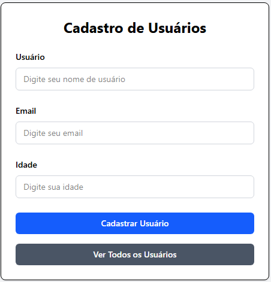
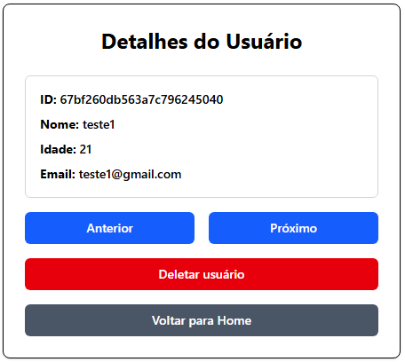

# **Full-Stack App com Node.js, Express, Prisma ORM, MongoDB, Vite e Tailwind CSS**

Este projeto é uma aplicação full-stack que combina um back-end API RESTful desenvolvido com **Node.js**, **Express** e **Prisma ORM** (integrado ao MongoDB), e um front-end construído com **Vite** e **Tailwind CSS**. Ele foi inspirado nos tutoriais do canal DevClub, mas com melhorias e funcionalidades adicionais implementadas para explorar conceitos avançados.

---

## **Funcionalidades Principais**

### **Back-end**

- API RESTful com rotas para CRUD (Create, Read, Update, Delete).
- Integração com banco de dados MongoDB via **Prisma ORM**.
- Validação de dados e tratamento de erros.
- Rotas protegidas para garantir segurança.

### **Front-end**

- Interface responsiva com **JavaScript Vanilla** e **Tailwind CSS**.
- Consumo da API RESTful para exibir e manipular dados.
- Componentização e reutilização de código.
- Uso do **Vite** para um ambiente de desenvolvimento rápido e eficiente.

---

## **Tecnologias Utilizadas**

### **Back-end**

- **Node.js**: Ambiente de execução JavaScript.
- **Express**: Framework para construção de APIs.
- **MongoDB**: Banco de dados NoSQL.
- **Prisma ORM**: Ferramenta para modelagem e acesso ao banco de dados.
- **node --watch**: Para reiniciar o servidor automaticamente durante o desenvolvimento.

### **Front-end**

- **Vite**: Ferramenta de build rápida para JavaScript Vanilla.
- **JavaScript Vanilla**: Código limpo e sem frameworks pesados.
- **Tailwind CSS**: Framework CSS utilitário para estilização.
- **Axios**: Biblioteca para comunicação HTTP com o back-end.

---

## **Como Executar o Projeto**

### **Pré-requisitos**

Certifique-se de ter as seguintes ferramentas instaladas:

- **Node.js** (versão 16 ou superior)
- **npm** ou **yarn**
- **MongoDB** instalado localmente ou acesso a um cluster no MongoDB Atlas.

---

## **Estrutura do Projeto**

```
/meu-projeto
  /backend
    - server.js (arquivo principal do servidor)
    - routes/ (rotas da API)
    - controllers/ (lógica dos endpoints)
    - prisma/ (configuração do Prisma e schema)
    - .env (variáveis de ambiente)
  /frontend
    - index.html (ponto de entrada da aplicação)
    - main.js (arquivo principal do JavaScript Vanilla)
    - assets/ (imagens, ícones, etc.)
    - styles/ (estilos customizados, se houver)
    - tailwind.config.js (configuração do Tailwind CSS)
```

---

## **Melhorias Implementadas**

Além do conteúdo dos tutoriais, foram implementadas as seguintes melhorias para explorar habilidades adicionais e aprimorar o projeto:

- **Design Responsivo com Tailwind CSS**:

  - Aplicação de estilos modernos e responsivos utilizando **Tailwind CSS**.
  - Criação de um layout limpo e visualmente atraente, adaptável a diferentes tamanhos de tela (desktop, tablet e mobile).
  - Uso de classes utilitárias para garantir consistência no design e facilitar manutenções futuras.

- **Divisão em Páginas**:

  - Estruturação do front-end em páginas distintas, como `Home`, `Users`.
  - Cada página foi desenvolvida com foco em uma experiência de usuário clara e organizada, garantindo que o conteúdo seja apresentado de forma intuitiva.

- **Adição de Rotas**:
  - Implementação de navegação entre páginas usando rotas dinâmicas.
  - Configuração de rotas para garantir que cada funcionalidade tenha sua própria URL, melhorando a usabilidade e a organização do projeto.
  - Exemplo de rotas:
    - `/`: Página inicial com o cadastro dos usuários.
    - `/Users`: Página de listagem dos usuários.

---

## **Capturas de Tela**

Capturas de tela da aplicação do tutorial:



Capturas de tela da aplicação:




---

## **Licença**

Este projeto está licenciado sob a [MIT License](LICENSE).

---

## **Referências**

Este projeto foi inspirado nos seguintes tutoriais:

- [Criando uma API do ZERO com Node.js e Banco de Dados - DevClub](https://www.youtube.com/watch?v=PyrMT0GA3sE)
- [Aprendendo React do Zero, Conectando Back e Front End, e Consumindo API - DevClub](https://www.youtube.com/watch?v=_gHr2Pe5LCY)

---
